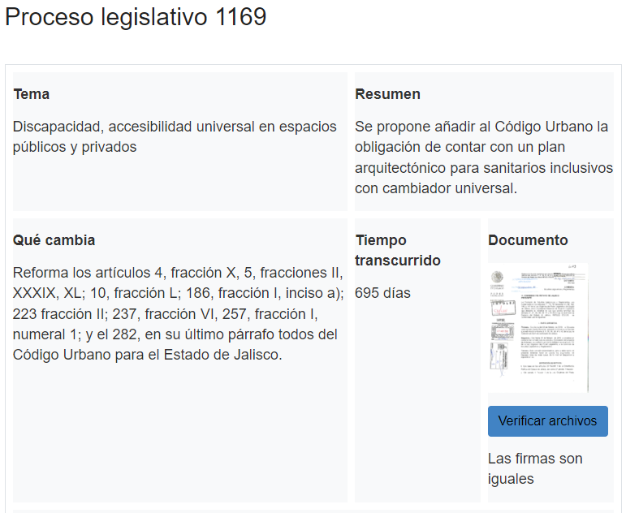

# Prototipo de criptografia para Sigue al Congreso
Autores: [Alfredo Murillo Madrigal](https://www.linkedin.com/in/alfredomurillomadrigal/), [Juan Pablo Bernal Lafarga](https://www.linkedin.com/in/juan-pablo-bernal-lafarga-7b9942232/), [Francelio Uriel Rodríguez García](https://linkedin.com/in/franceliouriel/), [Juan Pablo Valenzuela Dorado](https://www.linkedin.com/in/juan-pablo-valenzuela-dorado-5763b6250/).

Validación de datos integrada en el sitio web de siguealcongreso.org usando Flask, Python, bootstrap y HTML.

## Propuesta

### Problema
Ante la necesidad de validar los datos de los archivos de Sigue al Congreso ante cambios maliciosos y la dificultad de consultar estos cambios.

### Solución
Usando software podemos firmar digitalmente los archivos que requieran de válidación y hacer una verificación de la firma al cargar los archivos.

### Herramientas
GPG: Software de firma digital
Python: Lenguaje de programación usado para implementar las soluciones.
HTML: Lenguaje de marcado que estructura páginas web.
Flask: Framework de python que ayuda a formatear, crear y hacer funcionar sitios web.
gnupg: Librería para usar GPG con python
regex: Librería de python que permite buscar patrones de texto usando expresiones regulares.
Bootstrap: Framework para crear elementos estilizados en sitios web.

### Implementación
- Creamos varias funciones auxiliares en Python, para leer HTML usando regex y así identificar los archivos que necesitamos validar. Una vez identificados, usamos algunas funciones de gnupg para crear y comparar las firmas del documento original, y del documento a verificar. Implementamos diferentes excepciones en caso de error.

- Tomamos como base el HTML del sitio web de Sigue al Congreso, lo estilizamos usando Bootstrap para que la página web luzca lo más parecida posible. De nuevo usando Bootstrap creamos un botón debajo del acceso al archivo que buscamos válidar y asignamos una variable para recibir información.

- Por último usando Flask conectamos el botón con la función que creamos en python, haciendo que esta se active al presionarlo, y regresa a la variable que creamos en el html una cadena de texto que indica si el archivo es el original, si sufrió algún cambio o si hubo algún error.

## Resultado

  

